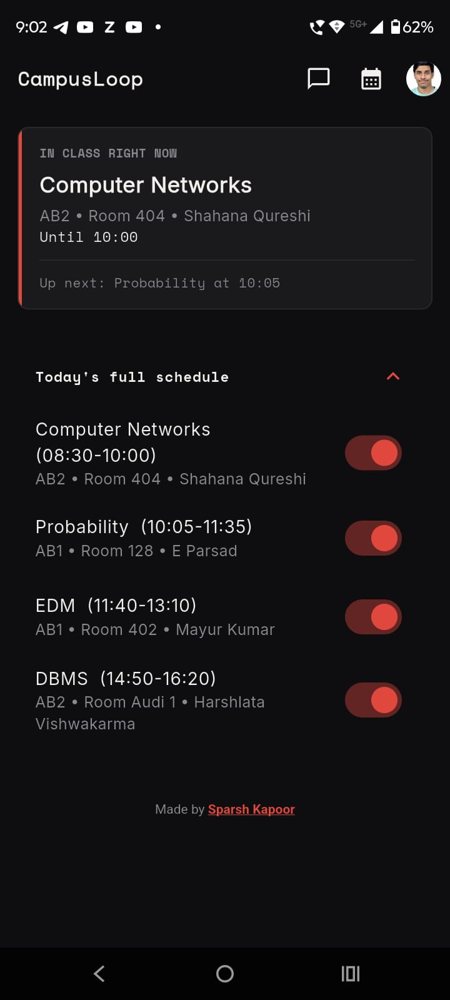
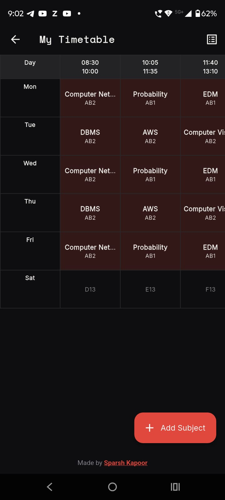
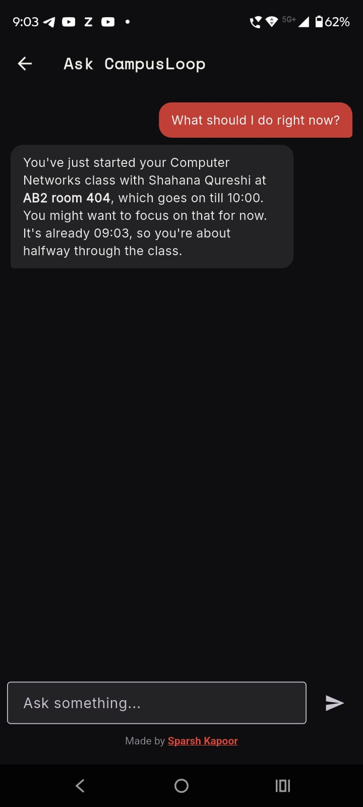

# CampusLoop

A location- and time-aware campus companion app for VIT Bhopal students, built in Flutter.

CampusLoop knows your FFCS timetable, the walking distance between every building/hostel/canteen on campus, and the hostel mess timings — and uses that to answer the question every hosteller asks between classes: **"Do I have time to go back, eat, and get to my next class?"**

<!-- 
<p float="left">
  
  
  
</p>
 -->

## Features

- **No-login registration** — anonymous, persistent per device. Just name, gender, and hostel block.
- **FFCS-style timetable entry** — pick a subject once (name, faculty, building, room), then check off every slot it occupies across the week, using VIT Bhopal's actual slot grid.
- **Home dashboard** — shows your next class, and a live recommendation:
  - Enough time to go to the **hostel mess** and back? ✅
  - Not quite, but a **canteen** works? 🟠
  - Too tight — **stay put**. ⏱️
  - Recommendation logic accounts for walking time (precomputed distance matrix), a meal-eating buffer, and a safety margin — not just raw gap time.
- **Cancelled-class handling** — mark a class cancelled for the day and the whole day's plan recalculates.
- **AI chat, scoped tightly to campus logistics** — powered by Groq (Llama 3.3 70B), grounded in your real schedule/hostel/distance data so it doesn't hallucinate campus specifics. Deliberately restricted: no homework help, no campus-controversy discussion, no medical/relationship advice, and a dedicated (non-refusing) path for genuine mental health distress that points to VIT Bhopal's real counselling resources and crisis helplines.
- **Profile** — photo, hostel block (editable), and quick access to edit your timetable.
- **Dark, departures-board-inspired UI** — monospace time/data display, color-coded recommendation cards, one consistent accent color throughout.

## Tech Stack

- **Flutter** (Dart) — UI, single codebase
- **Firebase**
  - Firestore — student data, campus location data, precomputed distance matrix, mess timings
  - Anonymous Authentication — no email/password, one identity per device install
- **Groq API** (Llama 3.3 70B) — chat assistant
- **Google Maps Distance Matrix API** — used once, offline, to precompute walking times between every campus location (not called at runtime)

## Architecture / Data Model

```
students/{uid}
  firstName, lastName, gender, hostelBlock, photoBase64, createdAt

students/{uid}/timetable/{slotCode}
  subject, faculty, building, roomNumber, day, startTime, endTime

students/{uid}/cancellations/{yyyy-mm-dd}
  slotCodes: [ ... ]

campusLocations/{locationId}      (read-only, seeded once)
  name, type, latitude, longitude

distanceMatrix/{locationId}       (read-only, seeded once)
  { otherLocationId: walkTimeMinutes, ... }

messTimings/default               (read-only, seeded once)
  breakfastStart/End, lunchStart/End, eveningsnacksStart/End, dinnerStart/End
```

Firestore security rules restrict every student to reading/writing only their own `students/{uid}` document and subcollections; campus-wide data (locations, distances, mess timings) is read-only for clients and only written by an offline seeding script using a service account.

## Running This Yourself

This repo doesn't ship with a live Firebase/Groq backend — you'll need your own:

1. `flutter pub get`
2. Create a Firebase project, enable **Firestore** and **Anonymous Authentication**
3. Run `flutterfire configure` to generate `lib/firebase_options.dart`
4. Seed `campusLocations`, `distanceMatrix`, and `messTimings` for your own campus (see the one-time Python seeding script — requires a Google Maps Distance Matrix API key)
5. Create `lib/groq_config.dart`:
   ```dart
   const String groqApiKey = 'YOUR_GROQ_API_KEY';
   ```
6. `flutter run`

The slot grid and building/hostel/canteen data are currently hardcoded for **VIT Bhopal** specifically — adapting this to another campus means updating `slot_data.dart`, `campus_data.dart`, `hostel_data.dart`, and reseeding the Firestore data.

## Known Limitations / Roadmap

- Assignment/deadline tracking and club/sports event integration are planned but not yet built.
- No push notifications yet (recommendations only update when the app is open).
- Chat history is session-only by design, not persisted.

## Credits

The FFCS timetable slot-grid concept is adapted from [FFCS-VITB-Maker](https://github.com/Cyb3rGhoul/FFCS-VITB-Maker) by [Cyb3rGhoul](https://github.com/Cyb3rGhoul) — a great manual FFCS visualizer for VIT Bhopal students. CampusLoop builds on that idea with fixed campus data, location-aware recommendations, and an AI assistant layered on top.

---

Made by [**Sparsh Kapoor**](https://github.com/SparshKapoor-CODER)— [LinkedIn](https://www.linkedin.com/in/sparsh-kapoor-sk/)
